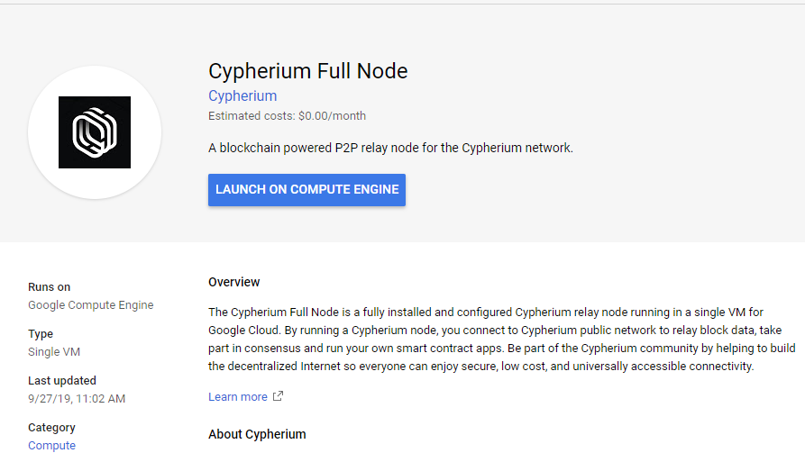
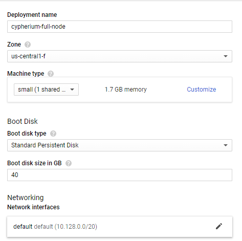

## Deploy
### Start

#### Please note:   
The estimated cost shown on the Google Cloud Marketplace does not include Google Cloud’s network cost. On average, the network cost should
be around $10/mo. You can find out more about [network service pricing](https://cloud.google.com/network-tiers/pricing) from Google Cloud.Deploying and joining the Cypherium network is as simple as a
few clicks. From our marketplace page,click on the “Launch on Compute Engine” button, and you should be able to see the following page to configure your
instance.
### Edit
Edit deploy name,disk size,cpu type,ram size etc.

Open firewall rules

The default values are sufficient for most of these settings, however there are a few options you may want to consider:
*  Deployment name: your instance name will be generated using the deployment name with a ‘-vm’ suffix.
*  Zone: your instance will be located in this geolocation zone. There is no “best” zone to deploy to, while there are a few factors you might want to consider
    such as your Internet connection quality to it, how many nodes are there already
    in that zone, etc.
*  Machine type: while the default micro instance should work at the moment, it may not be enough in the future when there are more traffic in the network.
    So you might want to choose based on the network status.
*  Boot disk type: Standard Persistent Disk should be enough.
*  Boot disk size: required boot disk size depends on the history data size of the network and grows with time, and you should only make this number bigger
    but not smaller.
*  Firewall: please allow all listed ports (as default), otherwise your nodes will not be able to relay traffic properly.
### Deploy result
When you are done customizing the deployment, you can start the actual deployment process by clicking on the “Deploy” button at the bottom. After a while
you should be able to see the following screen indicating the deployment is successfully.

Please note that you may see a warning indicating that the specified disk size of 40GB is larger than image size of 10 GB. This is normal. The additional
disk space will offer plenty of room to store chain data allowing the node to run for a
long time into the future.

After the instance is created, SSH it

### SSH connect

Waiting some seconds,you will login in,such as:

Please change compute account to root,by typing su,if you have not created a root password yet, 'sudo passwd' will help you set a password to your root
account.The default password is '1'
### Run
Then enter to the path,and run the script:
cd cypherium/CypherTestBin/linux/
./ustart.sh
you will see:

## Next step
Please enter our [Github](https://github.com/cypherium/CypherTestBin/),to operate commands.
